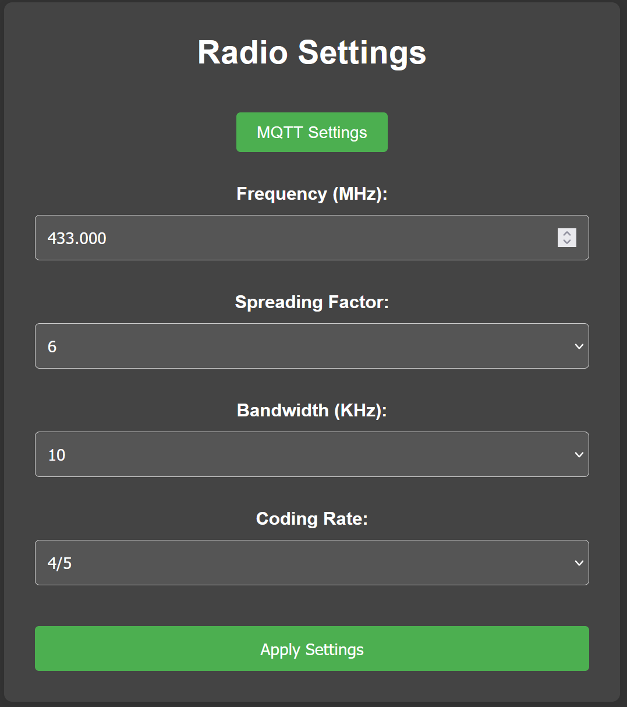
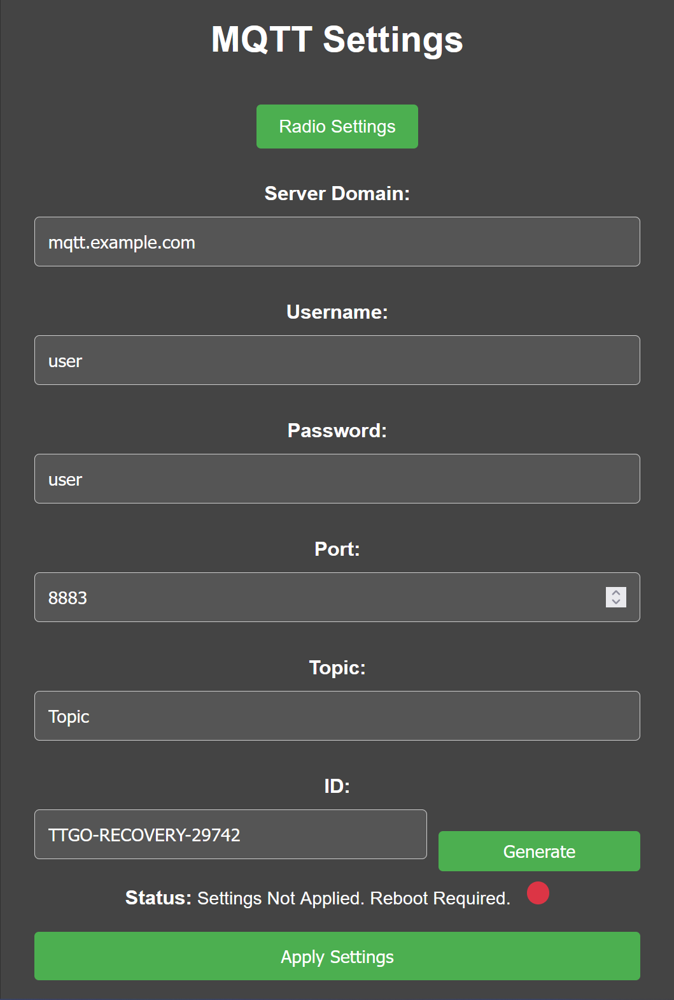

# TTGO-Recovery

## Portable tracker for [RTU HPR's](https://rocketlab.rtu.lv/) vehicles, used for recovery and in-flight telemetry based on [LILYGO LoRa32](https://www.lilygo.cc/products/lora3).
---
## Features:
- Telemetry packets reception & on-screen display capabilities.
- Packets logging to SD card.
- Packets upload to the MQTT server.
- Connectivity and configuration through WiFi.
---
## User manual:

### 1. Flashing the board
1. Install the PlatformIO and its requirements.
2. Open the project.
3. Open `.pio/libdeps/ttgo-lora32-v2/MUFFINS-Radio/src/MUFFINS_Radio.h` and go to line `9`.
4. Change `#define RADIO_MODULE 1` to `#define RADIO_MODULE 2`.
5. Build and upload the project (latest certificate will be pulled using pre-build scripts).

### 2. Configuration
After programming the board, it will boot up immediatelly.
To configure `LoRa` and `MQTT` follow these steps:
1. Turn on mobile hotspot. Set the SSID and password according to the on-screen instructions.
2. Wait for the TTGO to connect to the hotspot.
3. You can chack the IP of the conected TTGO in your phone/laptop's settings, or on the screen (in the footer).
4. In a web-browser, proceed to specified IP address.
5. Radio settings page will load. MQTT configuration can be found on separate page. Please note that for MQTT settings to take effect reboot is required.

__Radio Configuration__:

__MQTT Configuration:__

### 3. Operation
1. On reception of a new packet, the data on the screen is updated. If SD card is present and mounted, the packet will be logged there. If MQTT connection is established, the packet is sent there too.
2. TTGO will try to mount the SD card on boot and during the run-time.
3. TTGO will try to connect to the MQTT server during boot and during the run-time. (This also includes reconnect after WiFi / internet access loss).